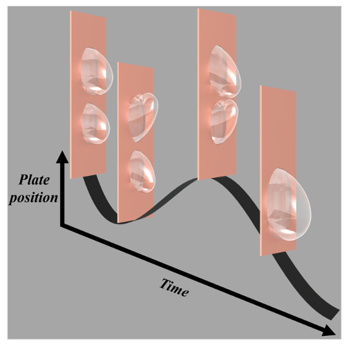

## Main topics
- Energy efficiency in building heating and cooling
- Heat exchangers, energy recovery
- Microfluidics
- Acoustic streaming 

## Micro- to mini-fluidics
Here we use *active* or *passive* process intensification techniques to enhance heat and mass transfer. For *active* techniques, we associate vibration (mechanical, acoustic or ultrasonic) sources to special flow channels (with sharp edges, bubbles...) to generate strong streaming flow. For *passive* process intensification, we have developped a patented flexible heat exchanger made of polymer. 

When two close drops on a plate are under vibration, they could merge if the frequency is well adjusted. This also depends on the wetting properties, as well as the sizes of the two drops. \

Below is a video showing how we enhance drop merging by mechanical vibration:\
 

At acoustic frequencies, about several kHz, we can generate strong acoustic streaming around a sharp edge:\ 

And this can strongly enhance mass transfer such as in mixing application: \

## Energy system modeling and optimization
to come...

## Soft heat exchangers
to come... 
